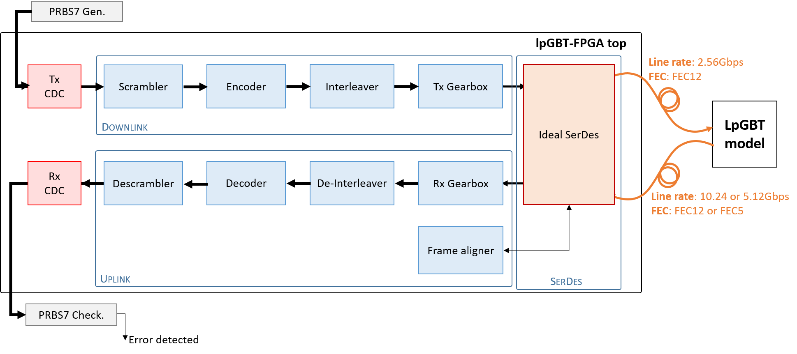
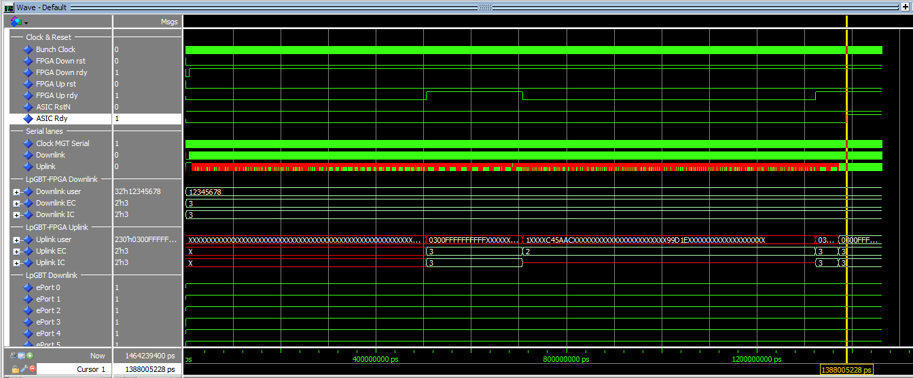

# LpGBT-FPGA IP Simulation environment (core version 2.2.0)

The LpGBT ASIC (Low Power GigaBit Transceiver) is a new 65nm-CMOS radiation tolerant serializer/deserializer
device that can be used on the front-end electronics of the HL-LHC detectors. This component is foreseen to
be used by CMS and ATLAS for their system upgrades and offers a set of encoding and decoding schemes specifically
tailored to meet their needs in terms of radiation-hardness and data bandwidth.

The LpGBT-FPGA project started in 2018 as a natural evolution of the existing GBT-FPGA to provide a back-end
counterpart to the future LpGBT ASIC. The new FPGA IP implements the encoding/decoding schemes supported by
the front-end ASIC, meaning that it can be configured using 4 different combinations for the upstream link
(from Front-end to Back-end): two decoding schemes (FEC5 or FEC12) based on Reed-Solomon techniques to configure
the encoding robustness and two line rates (10.24 or 5.12Gbps) depending on the required bandwidth. Additionally,
the LpGBT-FPGA core features an asymmetric architecture to match the LpGBT ASIC specificities: the transmitter
part of the IP, as opposed to the configurable receiver part, proposes a single encoding scheme (FEC12) and a
lower line rate of 2.56Gbps. Such an asymmetry prevents the IP to be used in loopback mode for self-testing.

<div style="border: 1px solid #faebcc; background:#fcf8e3; color:#8a6d3b; padding: .75rem 1.25rem; border-radius: .25rem;"><b>Warning:</b> Philosophy changed since the GBT-FPGA: the LpGBT-FPGA is not
anymore given as a generic module that can be implemented in one block. It is now proposed as a set of modules with implementation example and reference notes
to help the user in designing its own system in the most efficient way. **Example design can be subject to changes without notice as necessary.**</div>

## Links

- [Gitlab repo - LpGBT-FPGA IP](https://gitlab.cern.ch/gbt-fpga/lpgbt-fpga)
- [Documentation](http://lpgbt-fpga.web.cern.ch)
- [LpGBT Sharepoint] (https://espace.cern.ch/GBT-Project/LpGBT/default.aspx)

## Repository architecture

* **LpGBT-FPGA**: This folder contains the VHDL files that describe the logic of the different modules required to implements the IP (Encoder/Decoder, Scrambler/Descrambler, Gearboxes, Frame aligner)
* **cdc_user**: This folder contains an example of how to implement a clock-domain-crossing for 40MHz to 320MHz (with clock-enable) for fixed-latency applications. 
* **Mgt**: This folder contains the Mgt module used to serialize/deserialize the data. In the case of the KCU105 design, it contains a GTH Transceiver (Xilinx).
* **TCL**: This folder contains the TCL script that defines the procedure to compile and simulate the project
* **Constraints**: IO and timming constraints
* **hdl**: VHDL sources of example design's files (LpGBT-FPGA top level, Stimulis, ...).

<div style="border: 1px solid #faebcc; background:#fcf8e3; color:#8a6d3b; padding: .75rem 1.25rem; border-radius: .25rem;"><b>Warning:</b> This simulation uses an ideal SerDes to emulate an FPGA MultiGigaBit transceiver which receives a reference clock equal to the upstream line-rate. In real-life applications, the MGT reference clock is 320MHz. In addition, the ideal SerDes does not implement a CDR circuitry.**</div>

## How-to

Before running the tcl scripts, the lpgbt_model and lpgbt-fpga submodules have to be updated by executing the following procedure:

> **Tip:** Before using the simulation, the users have to update the the submodules using the following terminal commands:
> ```
> cd lpgbt-fpga-simulation
> git submodule init
> git submodule update
> ```
> Or  using tortoise git:
> ```
> right click > TortoiseGit > Submodule Update
> ```

## Simulation testbench



The `tcl/testbench.tcl` script expose different functions allowing to run the simulation and play with the system. To play with the system, this script forces internal signals of the simulation, therefore, it is necessary that the simulation is not optimized.

### How to run the simulation

First step consists in loading the firmware, compiling the sources and starting the simulation.

```
1. Open Modelsim (the simulation was tested in ModelSim SE 10.7)
2. In TCL console, cd to the LpGBT-FPGA folder: "cd C:/git/lpgbt-fpga-simulation/"
3. Source the TCL script: "source TCL/testbench.tcl"
4. Compile the project: "compile_project"
5. Run the simulation: simulate 1 2 (obs: the command is simulate FEC DATARATE; FEC 1=FEC5,2=FEC12; DATARATE 1=5G,2=10G)
6. Reset downlink FPGA: downlink_reset
7. Reset lpGBT: lpgbt_reset
8. Reset uplink FPGA: uplink_reset
9. Run simulation: run 1500 us
```

The expected waveforms are shown in the picture below:



### List of TCL procedures:

The tcl procedures are divided in 3 parts: lpgbt control, downlink and uplink.

**lpGBT procedures:**
* **lpgbt_reset**: Reset lpGBT.
* **lpgbt_waitForLock**: Wait for lpgbt lock until timeout. Return 0 when locked, -1 otherwise.
* **lpgbt_isLocked**: Get lock status of lpGBT.

**Downlink procedures:**
* **downlink_reset**: Do a downlink FPGA reset.
* **setDownlinkELinks**: Set all downlink bits to 1.
* **clearDownlinkELinks**: Set all downlink bits to 0.

**Uplink procedures:**
* **uplink_reset**: Do an uplink reset
* **uplink_waitForLock {{timeout 30}}**: Wait for uplink lock until timeout. Return 0 when locked, -1 otherwise.
* **uplink_waitForUnLock {{timeout 30}}**: Wait for uplink unlock until timeout. Return 0 when unlocked, -1 otherwise.
* **uplink_isLocked**: Get lock status of uplink path.
* **setUplinkELinks**: Set all uplink bits to 1.
* **clearUplinkELinks**: Set all downlink bits to 0.
